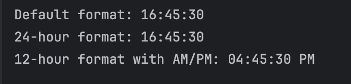

# Exploring Java `Date` and `Time` `API`

**Name:** Andre Dominic Ha Lacra

---

## Output Screenshots and Explanations per Exercise

---

### Exercise 1: `LocalDate` and `DateTimeFormatter`

**Prediction**  
Declare a `LocalDate` representing `August 21, 2025`. It then defines two custom date formats: one in the `"dd/MM/yyyy"` pattern and another in a full, readable format like `"Thursday, August 21, 2025"`. The program/code prints the default ISO format `(2025-08-21)` and both custom-formatted versions of the date.

**Observation**  
```
Default format: 2025-08-21
Custom format 1: 21/08/2025
Custom format 2: Thursday, August 21, 2025
```

**Output Screenshot:**  


---

### Exercise 2: `LocalTime` and `DateTimeFormatter`

**Prediction**  
The output will show the default time format as `16:45:30`. The 24-hour custom format also displays `16:45:30`. The 12-hour format with `AM/PM` converts it to `04:45:30 PM`. This is because `LocalTime.of(16, 45, 30)` represents `4:45:30` in the afternoon.

**Observation**  
```
Default format: 16:45:30
24-hour format: 16:45:30
12-hour format with AM/PM: 04:45:30 PM
```

**Output Screenshot:**  


---

### Exercise 3: `LocalDateTime` and `DateTimeFormatter`

**Prediction**  
The output will display the default format as `2025-11-27T19:00`, following `ISO-8601`. The custom format will show `Nov 27, 2025 at 07:00 PM`, since `19:00` in 24-hour time converts to `07:00 PM` in 12-hour format.

**Observation**  
```
Default format: 2025-11-27T19:00
Custom format: Nov 27, 2025 at 07:00 PM
```

**Output Screenshot:**  


---

### Exercise 4: The Immutability of Date-Time Objects

**Prediction**  
The output will show that the start date remains `2025-08-07` even after calling `plusDays(7)`, because `LocalDate` is `immutable`. The new end date will be `2025-08-14`, which is the result of explicitly assigning the modified date to a new variable.

**Observation**  
```
Start date after trying to modify it: 2025-08-07
The original start date is still: 2025-08-07
The new end date is: 2025-08-14
```

**Output Screenshot:**  


---

### Adding and Subtracting Time (`plus` and `minus`)

**Prediction**  
The output will show the base time as `2022-12-12 19:25`. The future time adds 3 years, 1 month, and 7 hours, resulting in `2026-01-13 02:25`. The pastime subtracts 2 weeks and 4 days, giving `2022-11-24 19:25`.

**Observation**  
```
Base time:   2022-12-12 19:25
Future time: 2026-01-13 02:25
Pastime:   2022-11-24 19:25
```

**Output Screenshot:**  


---

### Exercise 6: `Period` - Measuring a Span of Time

**Prediction**  
The output will show the period between `December 2, 2002`, and `December 2, 2025`, as `23 years`, `0 months`, and `0 days`, since the dates share the same month and day, and only differ by 23 full years.

**Observation**  
```
The period between the two dates is: 23 years, 0 months, and 0 days.
```

**Output Screenshot:**  


---